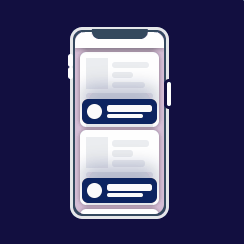

# UI-Collection

## Build With Vue

## Preview

### GIF Shot

#### code0001


#### code0002


#### code0003


#### code0004


#### code0005


#### code0006


#### code0008


#### code0009


#### code0010



### online demo

[DEMO HERE](http://animation.catsjuice.cn)

***************

devide line

***************

## Run Project

```zsh
cd src
```

Insatll Packages

```zsh
yarn
```

or install with NPM:

```zsh
npm install
```

Run The project, do

```zsh
yarn serve
```

or run with `npm`:

```zsh
npm run serve
```

By default, the project will run on server: `http://127.0.0.1:8080/`

